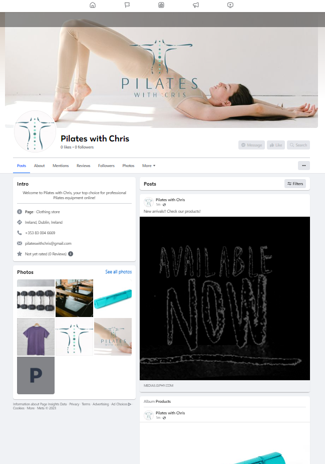
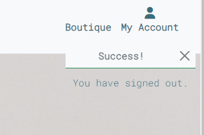
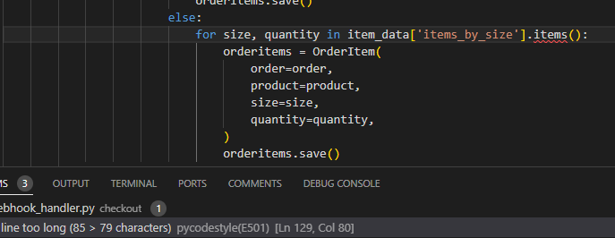
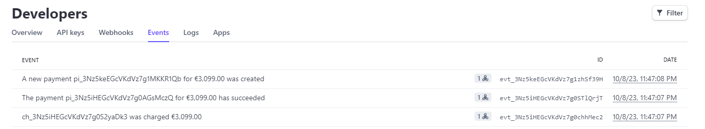

# [Pilates with Chris](https://pilateswithchris-69f3cf5687b6.herokuapp.com/)

## Overview

Pilates with Chris is a Pilates one-stop shop fictional E-Commerce website for members only. 
Cris, an experienced Pilates teacher, decided to start selling Pilates professional Pilates equipment. Users can add products to their shopping cart, rate them, and pay securely with Stripe.

## Project Goals

- As part of my journey as a student of Code Institute, the goal of this project is to demonstrate how I can apply my Bootstrap, Python & Django skills. I've built a fully friendly UX by not using the default built-in Django admin panel for the admin user view. 

## Business Model

### **Value Proposition**
- Offer a one-stop shop store for Pilates Studios to purchase professional equipment for use in their classes, providing convenience and saving user's time.
- Offer a range of exercise clothing and gear, leading to higher customer satisfaction and repeat business rate. 

### **Target Market**
- The main target audience will be B2B-focused, but B2C as a secondary audience.
- Focused target market strategy, warehouse in Ireland. 
- All equipment sold is only deliverable in Ireland due to high shipment costs to other countries making products more expensive. 

###  **Revenue Generation**
- Direct Online Sales: This is the primary revenue source.

###  **Distribution Channels**
- Direct Online Sales: This is the primary distribution channel. Customers can directly purchase products from the website.
- Social Media Platforms: Social media is used to direct traffic to the website.
- Email Marketing: Emails are used to promote products and offers. 
- B2B Partnerships: Partnerships with local Pilates Studios or fitness centers.

###  Marketing and Promotion

- Online Marketing: The website was created taking into consideration the digital marketing strategies for search engine optimization, social media, and email marketing.

### Facebook Page

- A Facebook mock-up page was created to promote the website's content. 

- - 

## Agile Methodology

- The development phase was applied with Agile methodologies to deliver small features with efficiency and maintain hypothetical business value. User stories were prioritized according to the MoSCoW method to deliver the primarily needed functionalities first.

Kanban board here: [Kanban Board](https://github.com/users/MartinFortuna/projects/7)

### User Stories

#### As a developer:
    1. As a developer, I can create a custom 404 page so that the customer has a link to return to the home page.
    2. As a developer, I want to display feedback messages for almost every user action so the user is notified of the changes made to the database or session.

#### As an admin user:

    3. As an admin user, I want regular users to view my products so that I can generate revenue. 
    4. As an admin user, I want to view, add, edit, and delete products, so that I can manage my store. 
    5. As an admin user, I want to create or update a product inventory quantity, so that I can keep track of the quantities for each product in my warehouse.
    6. As an admin user, I want a product inventory quantity to be updated once it's purchased.     

#### As a regular website user I want:
    7. As a user, I want to easily understand the website's purpose and navigation, so that I can fully benefit from its services.
    8. As a user, I can register, log in, or log out on the website so that I can access the products feature.
    9. As a user, I can choose to view, edit, and delete my profile so that correct and erase my information.
    10. As a user, I want to be confident that the payment is secure so that I can feel safe. 
    11. As a user, I want to rate products so that I can share my opinion. 
    12. As a user, I want to easily search and filter products, so that I can easily find what I want.
    13. As a user, I want to select the size if size exists, so that I can purchase the suitable product.
    14. As a user, I want to view a confirmation and receive an email of my order, so that I see my purchase details. 
    15. As a user, I can view the website on different devices so that I can access it anytime.
    16. As a user, I can subscribe to a newsletter so that I can be informed of the latest news.
    17. As a user, I want to leave a testimonial so that others can know my opinion.
    18. As a user, I want to modify an existing order so that I can correct any mistakes.
    19. As a user, I want a contact form so that I can message the staff via email.
    20. As a user, I want to know how many products are left in stock so that I can quickly purchase items almost out of stock.
    21. As a user, I want to quickly log in using my social media account, so that I don't have to enter login details manually. 
    23. As a user, I want to add and edit products in my bag so that I can purchase what I want. 

#### As a returning website user I want:
    22. As a returning user, I want to view my order history so that I can keep track of my purchases and invoices.

## Design

The website is fully responsive and designed with an easy-access hamburger menu to make navigation intuitive on small to medium screens. I decided to use Bootstrap's light background along with its warning yellow across the website for consistency and pleasing colors. I've chosen to use Bootsrap5 card across the website for clean visuals.

### App Structure

- Non-authenticated user Flow:

- Authenticated regular user Flow:

- Authenticated admin user Flow:

### Wireframe:

Home page design wireframe:

### Data Schema:

- Relational Model - User (Allauth), User Details, Product, Product Rate, Category, Product Size, Inventory, Order, Order Item.

## Features

 ###  Home page

 - The home page was designed to be simple with an about us section and a newsletter subscription feature along with a nav bar and footer.

- 

 ###  Products page

 - The product's page is where users can see the product image, name, category, and rating. It also has all related sorting and search functionality.

- 

 ### Product detail page

 - The product detail page also provides the user with a description, quantity input selection, add to bag button, and quantity in inventory. For super users, the ability to add or update a product. 

  ###  Rate page

 - The user can rate the product.

- 

 ###  Bag page

 - The user can update or remove an item from the back, keep shopping, or checkout.  

- 

 ###  Checkout page

 - The user can see an order summary, checkout form, and secure payment with Stripe. 

- 

 ###  Checkout success page

 - The user can see an order confirmation. 

- 

###  Profile page

 - The user can personal details, order history and reset password. 

- 

###  Product management pages

 - The admin user has access to create and edit products, via the corresponding form, here's the add product form. 

- 

## Future Development

- When a product is purchased, the inventory quantity is updated. 
- Multiple colors for clothing. 
- Shipment information and status.
- Users can change information on orders pre-shipping.
- Webhooks and order placement via webhook if page closed post checkout. 

- Due to time constraints, I would not be able to implement these features on submission time. 

## Testing

### Solved Bugs:

- The toasts were not appearing, a Bootstrap class was creating the issue. I've fixed this by adding some style and JavaScript on the base.html.
- 

### Unsolved Bugs:

- CSRF token not set error is triggered on the local environment when accessing the checkout page, this makes the webhook not fire. I've consulted with tutors, but no one was able to find the issue. The payment still successfully goes through but the webhook code implemented does not work due to this issue. There are no errors in the console on the live version, so I was advised to submit the project as is and mention it here. 
- 

## Code Validation

### HTML

- I've run all pages of the website through [HTML Validator](https://validator.w3.org/ "HTML Validator") with no errors.

### Python

- I've run all Python files in all apps and root projects, and no errors were found, only style issues shown by pycodestyle. I've corrected all those in one go as can be seen in my commit history.
Unfortunately, I could not fix one line in webhook_handler.py, as can be seen here:
- 

### Javascript

- I've run my javascript files and only warnings for missing semicolons were shown, I've corrected it along with the Python commit on styles. 
[JS Validator](https://jshint.com/ "JS Validator")

### CSS

- I've run the only CSS file in the templates folder, and no errors are shown.
[CSS Validator](https://jigsaw.w3.org/css-validator/ "CSS Validator")

### Console

- No errors were found in the console.

## Manual testing
    All tests below passed:
        - Feedback messages:
            - Almost all user actions have meaningful feedback messages, as intended.
        - Navbar
            - Unauthenticated user:
                - The logo brings the user to the home page as intended.
                - Boutique brings users to the login page as intended. 
                - My account, shows login, and logout as intended. 
            - Authenticated regular user:
                - Boutique brings the user to the products page as intended. 
                - My account shows My profile, Logout, Logged as, as intended. 
                - My Profile brings the user to the profile page as intended. 
                - Logout brings user the to the logout page, as intended. 
            - Authenticated superuser:
                - My account shows Product Management, My Profile, Logout, and logged as, as intended. 
                - Product management, brings the user to the Add a Product view, as intended. 
                - My Profile brings the user to the profile page as intended. 
                - Logout brings user the to the logout page, as intended. 
        - Home page
            - All users:
                - Subscribe correctly works as intended at the time of this test, please note that MailChimp may deactivate the API if fake emails are entered.
                - Unsubscribe brings the user to the Unsubscribe page as intended, unsubscribe works as intended. 
                - MailChimp link correctly redirects users to the official website on a new page. 
        - Products page
            - Shows all products as intended. 
            - Filter filters by price in ascending order as intended.
            - Filter by rating filters in descending order as intended. 
            - Filter all products and return all products as intended. 
            - Filter Unisex works as intended.
            - Filter Women works as intended. 
            - Filter Men works as intended. 
            - Filter Equipment works as intended. 
            - Filter Gear works as intended.  
            - The search bar works as intended when searching for existing products.
            - If nothing matches the search criteria, or no search criteria is entered, an error message is displayed as intended and the user returns to the products page. 
            - The shopping cart Icon brings the user to the Shopping Bag page, as intended.
            - If the product is clicked, brings the user to the product detail page as intended. 
        - Product Detail page
            - Shows image, product name, price, category, rating, description, and quantity in stock as intended. 
            - Shows - and + inputs as well as size. Quantity < 1 and > 100 cannot be added to the bag, works as intended. 
            - Add to bag, per size and quantity works as intended. 
            - Keep shopping, works as intended. 
            - If a category is clicked, bring users to the products page showing all items of the selected category, which works as intended. 
            - If the image is clicked, brings the user to another page with a bigger picture, and works as intended.
            - If the rate this product is clicked brings the user the the rate product page, which works as intended.
            - Bag updates total if add to bag is clicked, works as intended.
            - If the user re-clicks on the add to bag, the quantity is added the the bag's current quantity, which works as intended.
        - Bag page 
            - If the shopping bag is empty, it displays No products in your bag yet! works as intended.
            - Bag display total and free delivery delta, works as intended.
            - Keep shopping brings the user to the products page, and works as intended.
            - Secure checkout redirects to the checkout page and works as intended. 
                - If an item is in the bag:
                    - The user can update the quantity, works as intended.
                    - Subtotal is shown as intended. 
                    - The user can remove the product from the bag, works as intended. 
        - Checkout page
            - The checkout form is prepopulated with the user information captured on account creation and works as intended.
            - User can add or edit checkout form, works as intended. 
            - Order summary shows items in the bag, their subtotal, total, and delivery delta, as intended.
            - The button to adjust the bag returns the user to the bag page and works as intended. 
            - Checkout card details correctly return validation errors, as intended.
            - Displays the amount to be charged, as intended.
            - When a payment is successful, the user is redirected the the checkout success page.
        - Checkout Sucess
            - Order Summary is shown and saved to the user's profile.
            - Confirmation email is sent to the user.
            - Button brings back to the home page and works as intended. 
        - My profile page
            - The user can view, edit, and delete profiles, works as intended. 
            - The user can see his order history and check each order detail, works as intended.
            - Reset password link brings the user to the reset password page, and the email is sent, and works as intended. 
        - Product Management
            - Add a product:
                - Only superusers have access to the add product page, works as intended.
                - Form validation does not allow empty fields, only if adding size none. Works as intended. 
                - Cancel button correctly returns the superuser to the products page, works as intended.
                - Superuser cannot add a product price that has more than 6 digits, works as intended.
            - Update a product:
                - Same features as Add a product but here user can only update if selects the correct size of the product. Works as intended.
            - Delete a product
                - Superuser can delete a product, works as intended.
        - Allauth
            - All allauth templates are customized to match the design.
            - Login
                - Users need a username and password to log in, works as intended.
                - Validation errors return to the user and work as intended. 
                - Users can access the sign-up page, which works as intended. 
                - Users can sign in, works as intended.
                - Users are redirected to the home page, which works as intended.
            - Register
                - Validation errors return to the user, if use exists, for example, works as intended.
                - Name and first name required for sign-up, works as intended.
                - Confirmation email is sent to the user's email address, and works as intended. 
            - Logout
                - Correctly logs out the user. 
        - Footer
            - Correctly redirects users to social media on new tabs. 

- Stripe 
- Payments are successful on events log as below

