# [Pilates with Chris](https://pilateswithchris-69f3cf5687b6.herokuapp.com/)

## Overview

Pilates with Chris is a Pilates one-stop shop fictional E-Commerce website for members only. 
Cris, an experienced Pilates teacher, decided to start selling Pilates professional pilates equipment. Users can add products to their shopping cart, rate them, and pay securely with Stripe.

## Project Goals

- As part of my journey as a student of Code Institute, the goal of this project is to demonstrate how I can apply my Bootstrap, Python & Django skills. I've built a fully friendly UX by not using the default built-in Django admin panel for the admin user view. 

## Business Model

### **Value Proposition**
- Offer a one-stop shop store for Pilates Studios to purchase professional equipment for use in their classes, providing convenience and saving user's time.
- Offer a range of exercise clothing and gear, leading to higher customer satisfaction and repeat business rate. 

### **Target Market**
- The main target audience will be B2B Focused, but B2C as a secondary audience.
- Focused target market strategy, warehouse in Ireland. 
- All equipment sold is only deliverable in Ireland due to high shipment costs to other countries making products more expensive. 

###  **Revenue Generation**
- Direct Online Sales: This is the primary revenue source.

###  **Distribution Channels**
- Direct Online Sales: This is the primary distribution channel. Customers can directly purchase products from the website.
- Social Media Platforms: Social media is used to direct traffic to the website.
- Email Marketing: Emails are used to promote products and offers. 
- B2B Partnerships: Partnerships with local Pilates Studios or fitness centers.

###  Marketing and Promotion

- Online Marketing: The website was created taking into consideration the digital marketing strategies for search engine optimization, social media, and email marketing.

### Facebook Page

- A facebook page will be//change once created// created to promote the website's content. 

## Agile Methodology

- The development phase was applied with Agile methodologies to deliver small features with efficiency and maintain hypothetical business value. User stories were prioritized according to the MoSCoW method to deliver the primarily needed functionalities first.

Kanban board here: [Kanban Board](https://github.com/users/MartinFortuna/projects/7)

### User Stories

#### As a developer:
    1. As a developer, I can create a custom 404 page so that the customer has a link to return to the home page.
    2. As a developer, I want to display feedback messages for almost every user action so the user is notified of the changes made to the database or session.

#### As an admin user:

    3. As an admin user, I want regular users to view my products so that I can generate revenue. 
    4. As an admin user, I want to view, add, edit, and delete products, so that I can manage my store. 
    5. As an admin user, I want to create or update a product inventory quantity, so that I can keep track of the quantities for each product in my warehouse.
    6. As an admin user, I want a product inventory quantity to be updated once it's purchased.     

#### As a regular website user I want:
    7. As a user, I want to easily understand the website's purpose and navigation, so that I can fully benefit from its services.
    8. As a user, I can register, log in, or log out on the website so that I can access the products feature.
    9. As a user, I can choose to view, edit, and delete my profile so that correct and erase my information.
    10. As a user, I want to be confident that the payment is secure so that I can feel safe. 
    11. As a user, I want to rate products so that I can share my opinion. 
    12. As a user, I want to easily search and filter products, so that I can easily find what I want.
    13. As a user, I want to select the size if size exists, so that I can purchase the suitable product.
    14. As a user, I want to view a confirmation and receive an email of my order, so that I see my purchase details. 
    15. As a user, I can view the website on different devices so that I can access it anytime.
    16. As a user, I can subscribe to a newsletter so that I can be informed of the latest news.
    17. As a user, I want to leave a testimonial so that others can know my opinion.
    18. As a user, I want to modify an existing order so that I can correct any mistakes.
    19. As a user, I want a contact form so that I can message the staff via email.
    20. As a user, I want to know how many products are left in stock so that I can quickly purchase items almost out of stock.
    21. As a user, I want to quickly login using my social media account, so that I don't have to enter login details manually. 
    23. As a user, I want to add, edit products in my bag so that I can purchase what I want. 

#### As a returning website user I want:
    22. As a returning user, I want to view my order history so that I can keep track of my purchases and invoices.

## Design

The website is fully responsive and designed with an easy-access hamburger menu to make navigation intuitive on small to medium screens.I decided to use Bootstrap's light background along with its warning yellow across the website for consistency and pleasing colors. I've chosen to user Bootsrap5 card accross the website for clean visuals.

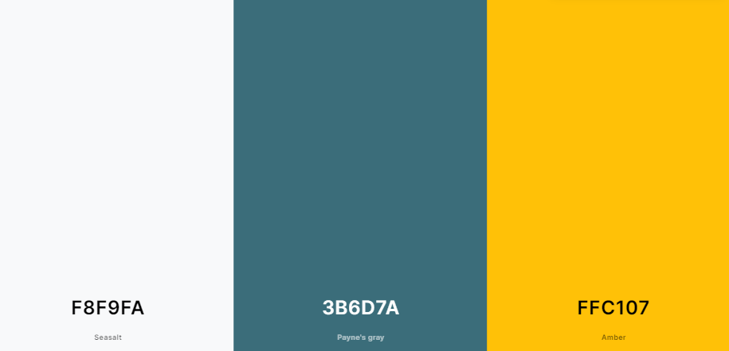

### App Structure

- Non-authenticated user Flow:

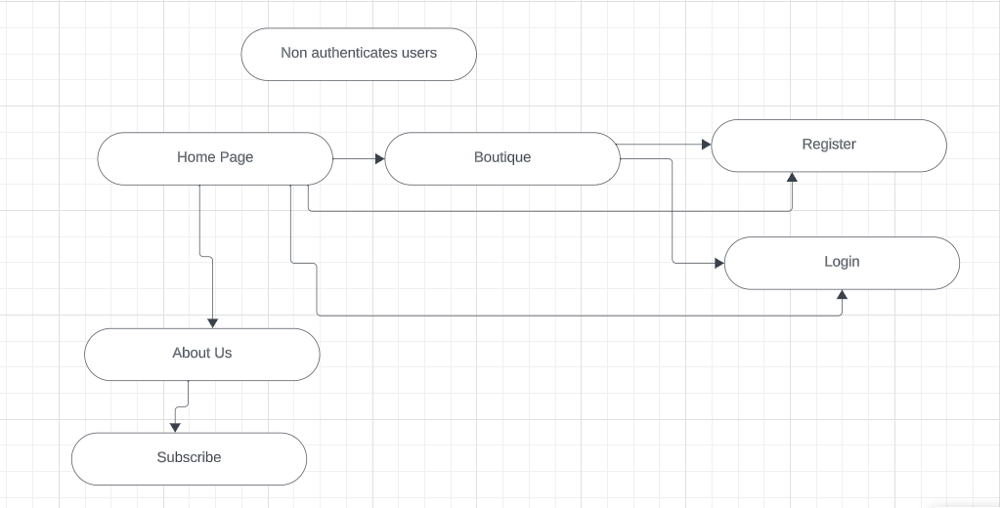

- Authenticated regular user Flow:

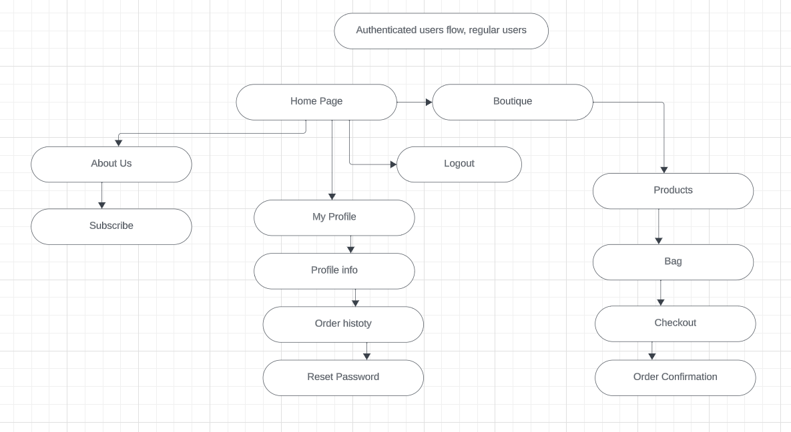

- Authenticated admin user Flow:

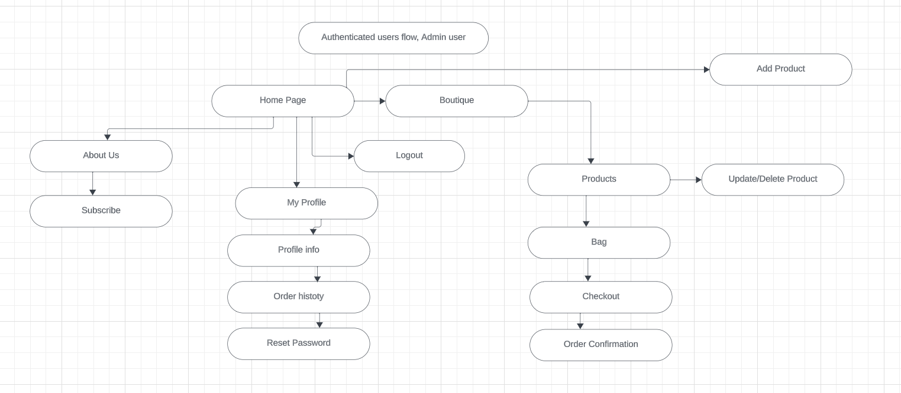

### Wireframe:

Home page design wireframe:

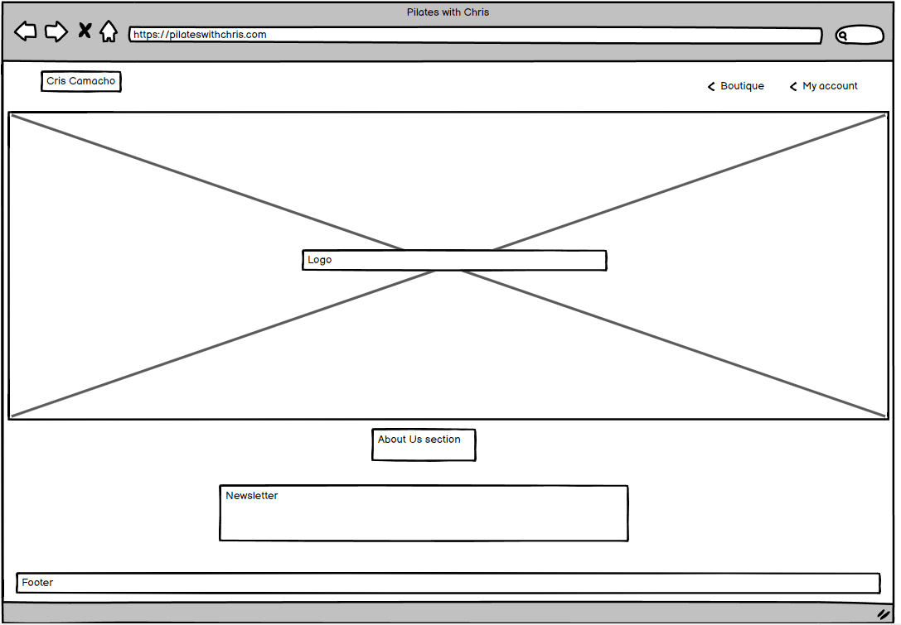

### Data Schema:

- Relational Model - User (Allauth), User Details, Product, Product Rate, Category, Product Size, Inventory, Order, Order Item.

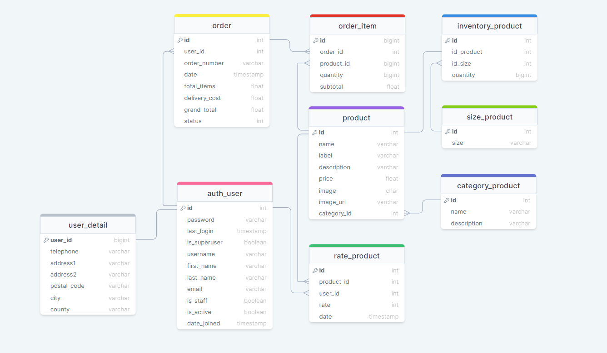

## Features

 ###  Home page

 - The home page was designed to be simpe with an about us section and a newsletter subscription feature along with nav bar and footer.

- 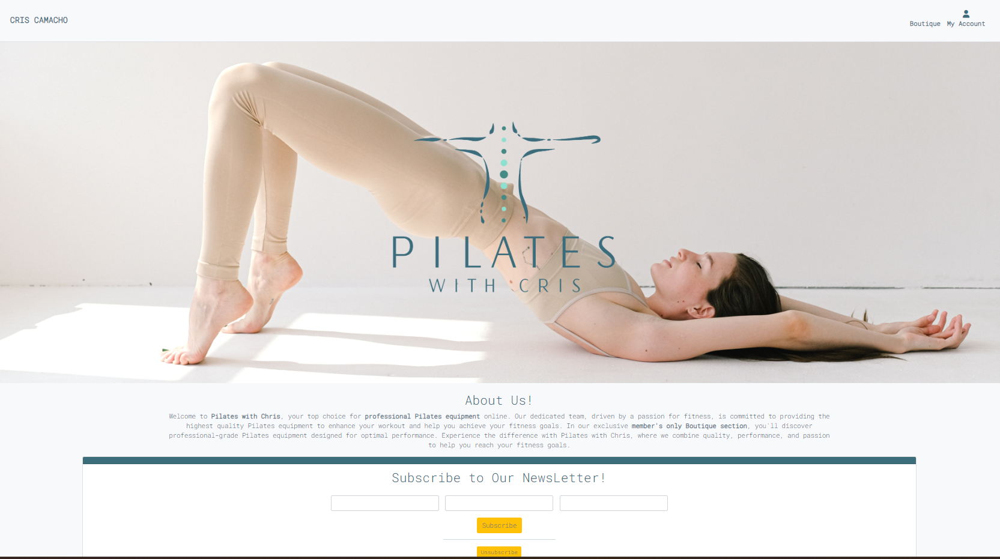

 ###  Products page

 - The product's page is where users can see the product image, name, category and rating. It also has all related sorting and search functionnality.

- 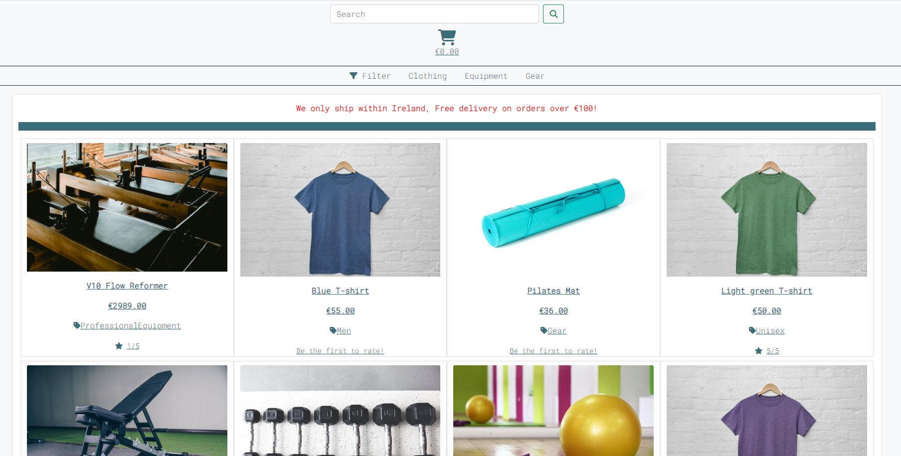

 ###  Products detail page

 - The product detail page also provides the user with a description, quantity input select, add to bag button and quantity in inventory. For super users, the ability to add or update a product. 

  ###  Rate page

 - The user can rate the product.

- 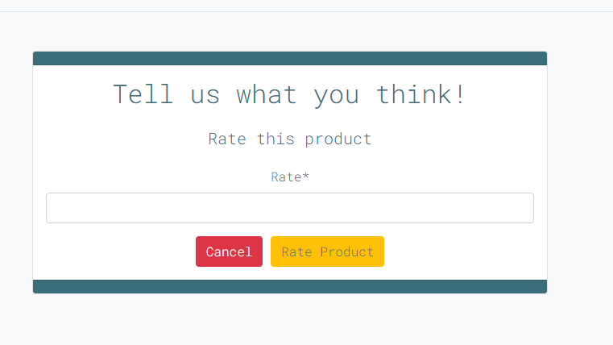

 ###  Bag page

 - The user can update or remove an item from the back, keep shopping or checkout.  

- 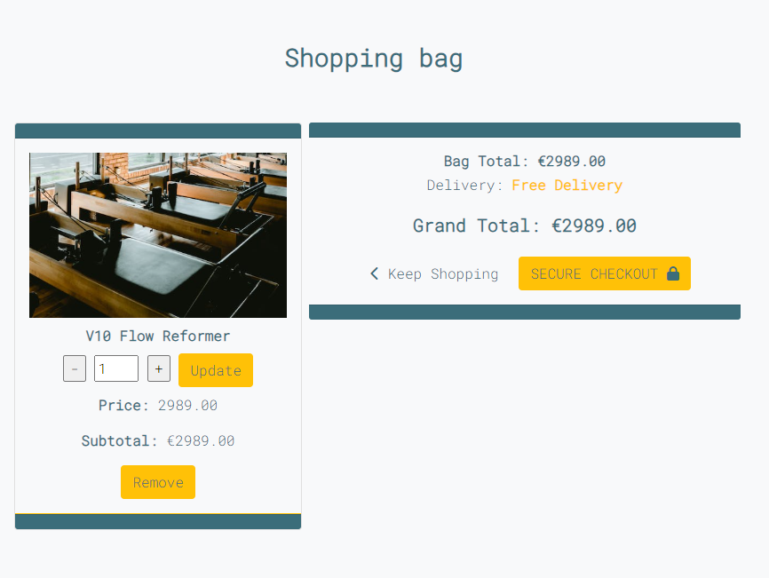

 ###  Checkout page

 - The user can see an order summary, checkout form and the secure payment with stripe. 

- 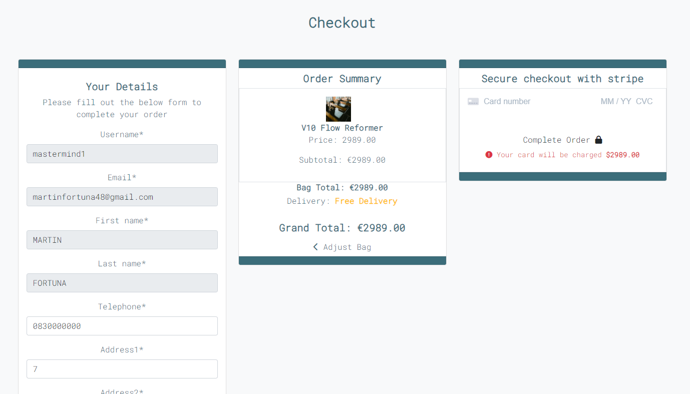

 ###  Checkout success page

 - The user can see an order confirmation. 

- 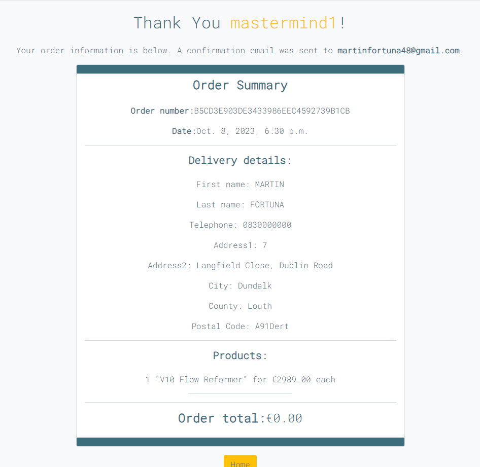

###  Profile page

 - The user can personal details, order history and reset password. 

- 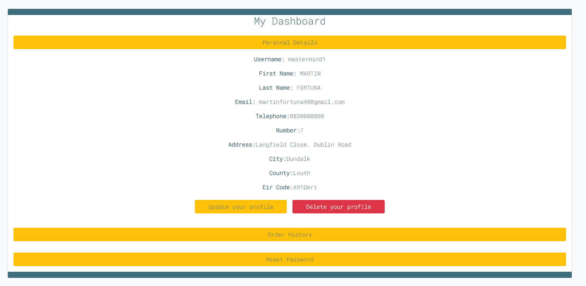

###  Product management pages

 - The admin user has access to create and edit products, via the corresponding form, here's the add product form. 

- 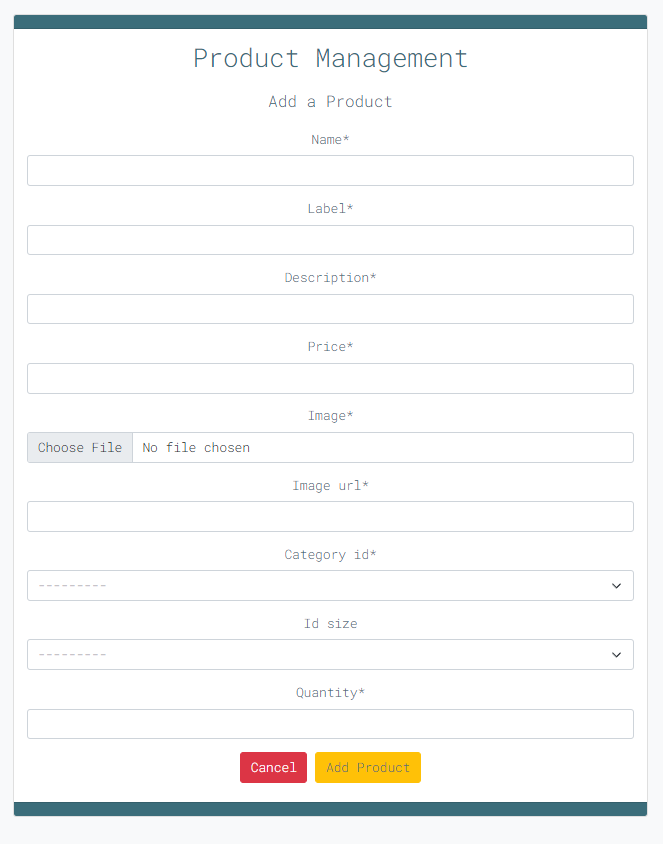

## Future Development

- When product is purchased, the inventory quantity update. 
- Multiple colors for clothing. 
- Shipment information and status.
- Users can change information on orders pre shipping.
- Webhooks and order placement via webhook if page closed post checkout. 

- Due to time constraints, I would not be able to implement these features on submission time. 

## Testing

### Solved Bugs:

- The toasts were not appearing, a Boostrap class was creating the issue. I've fixed this by adding some style and javascript on the base.html.
- 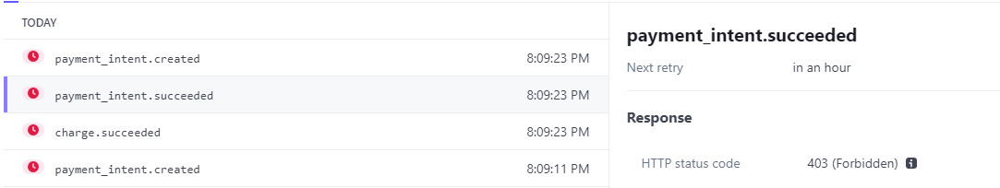

### Unsolved Bugs:

- CSRF token not set error is triggered on the local environment when accessing the checkout page, this makes the webhook not fire. I've consulted with tutors, but no one was able to find the issue. The payment still successfully goes through but the webhook code implemented does not work due to this issue. There are no errors in the console on the live version, so I was advised to submit the project as is and mention it here. 
- 

## Code Validation

### HTML

- I've run all pages of the website through [HTML Validator](https://validator.w3.org/ "HTML Validator") with no errors.

### Python

- I've run all Python files in all apps and root project, and no errors were found, only style issues shown by pycodestyle. I've corrected all those in one go as can be seen in my commit history.
Unfortunately I could not fix one line in webhook_handler.py, as can be seen here:
- 

### Javascript

- I've ran my javascript files and only warnings for missing semicolons were shown, I've corrected it along with the python commit on styles. 
[JS Validator](https://jshint.com/ "JS Validator")

### CSS

- I've run the only CSS file in the templates folder, and no errors are shown.
[CSS Validator](https://jigsaw.w3.org/css-validator/ "CSS Validator")

